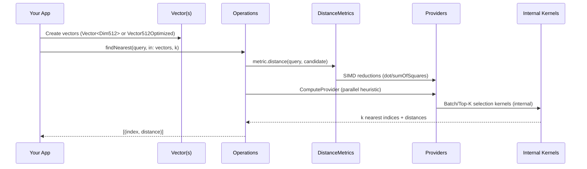
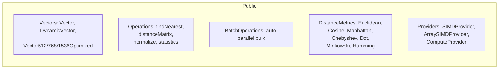

# VectorCore API Overview Map

This guide provides an intuitive, visual map of VectorCore and its role in the broader suite (VectorIndex, VectorAccelerate, VectorIndexAccelerated, VectorStore). It highlights public APIs vs internal layers, typical data flows, and how components fit together.

- Audience: engineers integrating VectorCore for on‑device vector compute on Apple Silicon.
- Focus: mental model first, details second. Multiple visuals are included, with Mermaid and ASCII fallbacks.

---

## TL;DR Mental Model

VectorCore is a CPU‑first, high‑performance vector math core for Swift. Use it to:
- Create vectors (fixed/dynamic/optimized),
- Compute distances/metrics,
- Run nearest‑neighbor operations via `Operations` (async) or `BatchOperations` (async bulk),
- Plug in Accelerate or Swift SIMD under the hood — no GPU code here.

Everything else (ANN/graphs, GPU kernels, durable stores) lives in sibling packages.

---

## Ecosystem Map (Packages)

```mermaid
flowchart LR
  subgraph Core[VectorCore]
    C1[Vectors
    (Vector<D>, DynamicVector,
    Vector512/768/1536Optimized)]
    C2[Operations (Public)
    findNearest, distanceMatrix,
    normalize, statistics]
    C3[DistanceMetrics (Public)
    Euclidean, Cosine,
    Manhattan, Chebyshev,
    Dot, Minkowski, Hamming]
    C4[Providers (Public)
    SIMDProvider, ArraySIMDProvider,
    ComputeProvider]
    C5[Utilities (Internal)
    Kernels, Buffer Pools,
    Aligned Storage, Heuristics]
    C1 --> C2
    C3 --> C2
    C2 --> C4
    C4 --> C5
  end

  subgraph Index[VectorIndex]
    I1[ANN structures (HNSW/NSW)]
    I2[Graph primitives/algorithms]
    I3[Clustering (KMeans, etc.)]
  end

  subgraph Accel[VectorAccelerate]
    A1[GPU/Metal providers]
    A2[Device‑specific fused kernels]
  end

  subgraph IndexAccel[VectorIndexAccelerated]
    IA1[Hybrid CPU/GPU ANN/Graph]
  end

  subgraph Store[VectorStore]
    S1[Durable binary formats]
    S2[Stores/adapters (e.g., SQLite)]
  end

  Core -.->|Public types/protocols| Index
  Core -.->|Public types/protocols| Accel
  Accel -.->|GPU providers| Core
  Index -.->|ANN/Graph uses Core types| Core
  IndexAccel -.->|Uses Index + Accel| Index
  Store -.->|Binary formats (durable)| Core
```

ASCII fallback (condensed):

```
VectorCore
  ├─ Vectors (public)
  ├─ Operations (public)
  ├─ DistanceMetrics (public)
  ├─ Providers (public)
  └─ Utilities/Kernels (internal)

VectorIndex            VectorAccelerate       VectorIndexAccelerated       VectorStore
  ├─ ANN/Graph           ├─ GPU providers       ├─ Hybrid CPU/GPU ANN         ├─ Durable formats
  └─ Clustering          └─ Fused GPU kernels   └─ Uses Core + Accel          └─ Adapters
```

Note
- VectorCore includes minimal in‑memory binary helpers for testing/interop. Durable, on‑disk formats and adapters live in VectorStore.

---

## VectorCore Architecture (Layers)

```mermaid
flowchart TB
  L1[Public API Surface]
  L1a[Operations]
  L1b[BatchOperations]
  L1c[DistanceMetrics]
  L1d[Vectors]

  L2[Providers]
  L2a[SIMDProvider (AccelerateFloat/Double)]
  L2b[SIMDProvider (SwiftFloat/Double)]
  L2c[ArraySIMDProvider (Default/Swift)]
  L2d[ComputeProvider (CPU)]

  L3[Internal Utilities]
  L3a[Kernels (Dot/Euclid/Cosine, Top‑K)]
  L3b[Heuristics (Parallel)]
  L3c[Memory & Storage (Aligned, Tiered)]
  L3d[Buffer Pools]

  L1a --> L2
  L1b --> L2
  L1c --> L2
  L1d -.-> L3c
  L2 --> L3
```

Notes
- Public code calls `Operations/BatchOperations` + `DistanceMetrics`.
- Providers abstract away implementation details (Accelerate vs Swift SIMD; CPU execution plan).
- Utilities (kernels/memory/pools/heuristics) are internal to keep API lean and stable.

---

## Typical Data Flow (k‑NN)



Key points
- Dimension checks happen at public API boundaries; metric hot paths avoid redundant checks.
- Providers decide SIMD implementation (Accelerate or Swift) and parallel strategy.
- Selection/Top‑K kernels are internal, ensuring room to optimize without API churn.

---

## Public API Map



Quick reference
- Vectors: fixed‑dim (compile‑time safety), dynamic (runtime), optimized (SIMD4 layout for 512/768/1536).
- Operations: async APIs for NN search, pairwise computations, normalization, and stats.
- DistanceMetrics: portable metric implementations (zero‑alloc); plug into Operations.
- Providers: protocol surface to bind Accelerate/Swift SIMD and execution strategy.

---

## Extending VectorCore (Examples)

- Custom Distance Metric

```swift
struct Lp3Metric: DistanceMetric {
    typealias Scalar = Float
    func distance<V: VectorProtocol>(_ a: V, _ b: V) -> Float where V.Scalar == Float {
        var sum: Float = 0
        a.withUnsafeBufferPointer { ap in
            b.withUnsafeBufferPointer { bp in
                for i in 0..<ap.count { sum += pow(abs(ap[i] - bp[i]), 3) }
            }
        }
        return pow(sum, 1.0/3.0)
    }
}
// Usage
let d = Lp3Metric().distance(v1, v2)
```

- Provider Override (Accelerate vs Swift SIMD)

```swift
await Operations.$simdProvider.withValue(DefaultArraySIMDProvider()) {
    // Calls inside use this array-SIMD provider
    let nn = try await Operations.findNearest(to: q, in: xs, k: 10)
}

// You can also override the compute provider (e.g., force parallel CPU mode):
await Operations.$computeProvider.withValue(CPUComputeProvider.parallel) {
    let dists = try await Operations.distanceMatrix(between: xs, and: xs)
}
```

- Choosing Optimized Vectors

```swift
let q = try Vector512Optimized((0..<512).map { _ in Float.random(in: -1...1) })
let xs: [Vector512Optimized] = ... // Enables fast fused kernels
let nn = try await Operations.findNearest(to: q, in: xs, k: 10)
```

---

## Performance Heuristics (At a Glance)

- Parallelization kicks in based on a heuristic of dimension × items vs overhead.
- BatchOperations auto‑parallelizes for large inputs; Operations uses ComputeProvider heuristics.
- Optimized vectors (512/768/1536) unlock fused kernels and Top‑K fast paths internally.

---

## Public vs Internal (Cheat Sheet)

- Public: `Vectors`, `Operations`, `BatchOperations`, `DistanceMetrics`, `SIMDProvider`/`ArraySIMDProvider`/`ComputeProvider`.
- Internal: `Kernels`, `Top‑K selection`, `Buffer pools`, `Aligned storage`, `Heuristics`, many low‑level helpers.
- Out of scope (in sibling packages): ANN/graphs/clustering (VectorIndex), GPU providers/kernels (VectorAccelerate), durable formats (VectorStore).

---

## Glossary

- SIMD: Single Instruction, Multiple Data (vectorized CPU operations).
- Accelerate: Apple’s high‑performance DSP/BLAS framework.
- Optimized vectors: Storage layout as `ContiguousArray<SIMD4<Float>>` for tailwind on Apple Silicon.
- Heuristic: A simple model to choose parallel execution when it pays off.

---

## Appendix: ASCII Diagrams (Fallback)

Architecture:
```
[Public]  Vectors ──► Operations/BatchOperations ──► Providers
                                   │                     │
                                   ▼                     ▼
                             DistanceMetrics       Internal Utilities
                                                   (kernels/memory)
```

Ecosystem:
```
VectorCore (CPU math)  ◀──────── VectorAccelerate (GPU)
        │                             ▲
        ▼                             │
   VectorIndex (ANN/Graph)   VectorIndexAccelerated (hybrid)
        │
        ▼
   VectorStore (durable formats)
```

---

This map should help you—and future contributors—navigate the framework quickly, understand where to extend functionality, and avoid depending on internal details.
